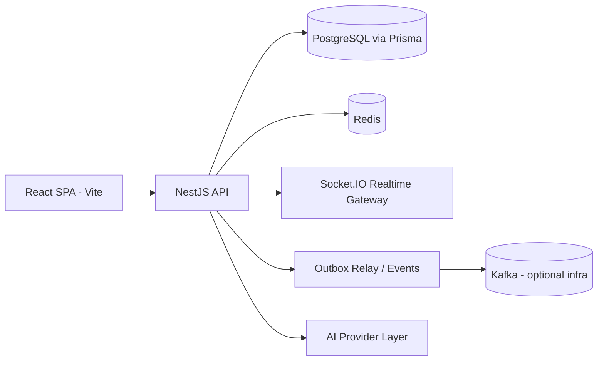

# Agile Flow Verse

Enterprise-grade, multi-tenant delivery platform that merges agile execution, collaboration, automation, analytics, AI assistance, and operational controls into a single full-stack application.

This project is intentionally architected as a **complex, production-style system** rather than a simple CRUD demo.  
It demonstrates end-to-end engineering depth across frontend, backend, data modeling, security, real-time systems, and developer operations.

---

## Table of Contents

- [1. Product Vision](#1-product-vision)
- [2. Core Capabilities](#2-core-capabilities)
- [3. Architecture Overview](#3-architecture-overview)
- [4. Engineering Highlights](#4-engineering-highlights)
- [5. Tech Stack](#5-tech-stack)
- [6. Repository Structure](#6-repository-structure)
- [7. Local Development Setup](#7-local-development-setup)
- [8. Build and Run Commands](#8-build-and-run-commands)
- [9. API and Backend Surface](#9-api-and-backend-surface)
- [10. Data Model and Migrations](#10-data-model-and-migrations)
- [11. Security Model](#11-security-model)
- [12. Performance and Scalability](#12-performance-and-scalability)
- [13. Testing and Quality](#13-testing-and-quality)
- [14. Deployment and Operations](#14-deployment-and-operations)
- [15. Why This Project Stands Out](#15-why-this-project-stands-out)
- [16. Notes](#16-notes)

---

## 1. Product Vision

Agile Flow Verse solves a real-world fragmentation problem: engineering and product teams often spread work across multiple disconnected tools (planning, tracking, docs, reporting, notifications, automation, and stakeholder communication).

This application consolidates those workflows into one platform with:

- multi-tenant data isolation
- full project and delivery lifecycle management
- real-time collaboration and updates
- intelligent automation and AI-assisted productivity
- reporting and operational visibility for leadership

Target users:

- engineering teams
- product managers
- project/program managers
- agencies and service teams managing multiple clients/projects

---

## 2. Core Capabilities

### Delivery and Planning
- Projects, tasks, subtasks, dependencies, custom fields
- Sprint planning, backlog management, epics, definition of done
- Kanban and Gantt planning surfaces
- Issue tracking with advanced issue workflows and changelog support

### Collaboration
- Notes and comments
- Calendar integration and reminder jobs
- Notification center and service integrations
- Real-time updates via WebSocket events

### Automation and Intelligence
- Automation rules engine with execution history and replay support
- Event-driven design via outbox and queue-capable backend
- AI features for:
  - task generation
  - sprint planning and risk insights
  - retrospectives
  - estimation support
  - workflow analysis
  - natural language querying

### Business and Operations
- CRM module
- Finance module (invoices, expenses, budgeting)
- Analytics and reporting modules
- Monitoring and health endpoints

---

## 3. Architecture Overview



### Frontend Flow
- Entry: `src/main.tsx`
- Root composition and routes: `src/App.tsx`
- Route protection: `src/components/ProtectedRoute.tsx`
- Data access: `src/lib/api-client.ts` + `src/lib/api/*`
- Server-state orchestration: TanStack Query hooks under `src/hooks/`

### Backend Flow
- Entry: `src/api/main.ts`
- Module composition: `src/api/app.module.ts`
- Pattern: `controller -> service -> prisma`
- Cross-cutting layers:
  - auth guard
  - tenant context interceptor
  - idempotency interceptor
  - rate limit middleware
  - global validation + error envelope

---

## 4. Engineering Highlights

This codebase demonstrates advanced backend and full-stack patterns expected in senior-level systems:

- **Multi-tenancy:** tenant-aware identity and data scoping across all major domains
- **Auth depth:** JWT access tokens, refresh token lifecycle, OAuth providers, optional 2FA
- **Request hardening:** idempotency for mutating endpoints, correlation IDs, consistent error envelope
- **Real-time consistency:** WebSocket updates plus cache synchronization strategy
- **Async/event foundation:** outbox relay and queue-capable automation execution flow
- **Complex domain modeling:** agile, automation, finance, CRM, analytics in a single platform
- **Large modular backend:** many bounded domain modules with clear controller/service boundaries

---

## 5. Tech Stack

### Frontend
- React 19
- TypeScript
- Vite
- React Router
- TanStack Query
- Tailwind CSS
- Radix UI primitives
- Axios
- Socket.IO client

### Backend
- NestJS 10
- Prisma ORM
- PostgreSQL
- Redis
- Socket.IO
- BullMQ
- Swagger/OpenAPI
- Zod + class-validator

### Infrastructure and Tooling
- Docker and Docker Compose
- Kafka + Zookeeper (optional event infra)
- Jest + ts-jest
- ESLint + TypeScript compiler pipeline

---

## 6. Repository Structure

```text
.
├─ src/
│  ├─ api/               # NestJS backend modules
│  ├─ components/        # Frontend UI components
│  ├─ hooks/             # Query and feature hooks
│  ├─ lib/               # API client, auth, realtime, utilities
│  ├─ pages/             # Route-level frontend pages
│  ├─ services/          # Frontend service abstraction layer
│  └─ shared/            # Shared DTO/types
├─ prisma/
│  ├─ schema.prisma      # Canonical DB schema
│  └─ migrations/        # SQL migrations
├─ scripts/              # Utility and migration scripts
├─ docker-compose.yml    # Full stack compose setup
└─ env.example           # Environment variable template
```

---

## 7. Local Development Setup

### Prerequisites
- Node.js 18+
- npm
- Docker Desktop (recommended for local infra)

### 1) Install dependencies
```sh
npm install
```

### 2) Configure environment
```sh
cp env.example .env
```

Update values in `.env` for your local environment.

### 3) Start local infrastructure
```sh
docker-compose up -d postgres redis
```

### 4) Generate Prisma client and apply migrations
```sh
npx prisma generate
npx prisma migrate dev
```

### 5) Run frontend and backend
Frontend:
```sh
npm run dev
```

Backend (new terminal):
```sh
npm run api:dev
```

Defaults:
- Frontend: `http://localhost:5173`
- Backend: `http://localhost:3000`
- Swagger: `http://localhost:3000/v1/docs` (non-production)

---

## 8. Build and Run Commands

| Command | Purpose |
|---|---|
| `npm run dev` | Start frontend dev server |
| `npm run build` | Build frontend for production |
| `npm run preview` | Preview built frontend |
| `npm run api:build` | Compile backend into `dist-api` |
| `npm run api:dev` | Compile and run backend |
| `npm run api:start` | Run compiled backend |
| `npm run prisma:generate` | Generate Prisma client |
| `npm run prisma:migrate:dev` | Run development migrations |
| `npm run prisma:studio` | Open Prisma Studio |
| `npm test` | Run tests |
| `npm run test:coverage` | Run tests with coverage |

---

## 9. API and Backend Surface

Base path convention: `/v1/*`

Major route groups include:

- `/v1/auth`
- `/v1/users`
- `/v1/projects`
- `/v1/tasks`
- `/v1/issues`
- `/v1/sprints`
- `/v1/epics`
- `/v1/kanban`
- `/v1/gantt`
- `/v1/notes`
- `/v1/calendar`
- `/v1/notifications`
- `/v1/automation`
- `/v1/ai`
- `/v1/analytics`
- `/v1/reports`
- `/v1/crm`
- `/v1/finance`
- `/v1/monitoring`
- `/v1/health`

API docs:
- `http://localhost:3000/v1/docs`

---

## 10. Data Model and Migrations

Database layer:
- Prisma schema in `prisma/schema.prisma`
- PostgreSQL as the primary relational store
- Migration history in `prisma/migrations/*`

Domain model includes:
- tenant and user management
- role assignments and permissions
- project/task/issue/sprint/epic planning entities
- notes/comments/attachments
- automation rule and execution logs
- calendar and integration models
- CRM and finance models

This schema design reflects a real SaaS-level data model, not a toy sample.

---

## 11. Security Model

Security controls implemented across backend layers:

- JWT authentication and refresh token flow
- OAuth provider integration support
- Optional two-factor authentication
- API route guards and tenant scoping
- Request idempotency support for mutation safety
- Rate-limiting middleware
- Helmet security headers
- Environment validation at startup
- Structured error handling and trace IDs

---

## 12. Performance and Scalability

Performance-oriented patterns used in this codebase:

- React Query caching and invalidation strategies
- Lazy-loaded route-level frontend chunks
- Real-time targeted cache sync
- Redis-backed supporting services
- DB indexing patterns across tenant-scoped entities
- Outbox pattern foundation for scalable event-driven workflows

---

## 13. Testing and Quality

Current quality workflow includes:
- Jest test runner
- unit/service-level tests
- coverage reporting
- linting support

Run:
```sh
npm test
npm run test:coverage
npm run lint
```

---

## 14. Deployment and Operations

### Full-stack local/prod-like setup
```sh
docker-compose up -d
```

Compose includes:
- Postgres (`pgvector/pg15`)
- Redis
- Zookeeper
- Kafka
- backend service
- frontend service

Operational note:
- The compose file is set up for convenience and local orchestration.
- Use secure secret management for production deployments.

---

## 15. Why This Project Stands Out

If you are evaluating this repository as a recruiter or engineering leader:

- it is a true full-stack system, not a tutorial app
- it demonstrates architecture for complex, multi-domain business workflows
- it shows strong backend engineering fundamentals (security, modularity, data design, reliability patterns)
- it includes advanced product capabilities (automation, analytics, AI, realtime, multi-tenancy)
- it reflects the type of scope and systems thinking expected from top-tier engineers

In short: this project showcases the ability to design and ship a **high-complexity, production-style platform** end-to-end.

---

## 16. Notes

- This repository includes active feature development and migration work.
- Review migration ordering and deployment process before pushing to production.
- Never commit real secrets; keep credentials in `.env` and secure vault systems.
